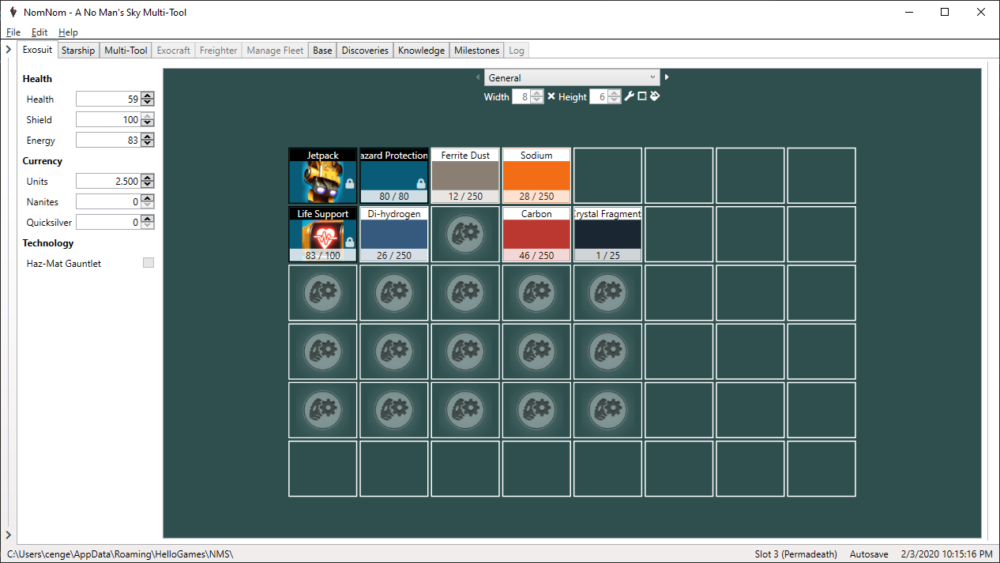
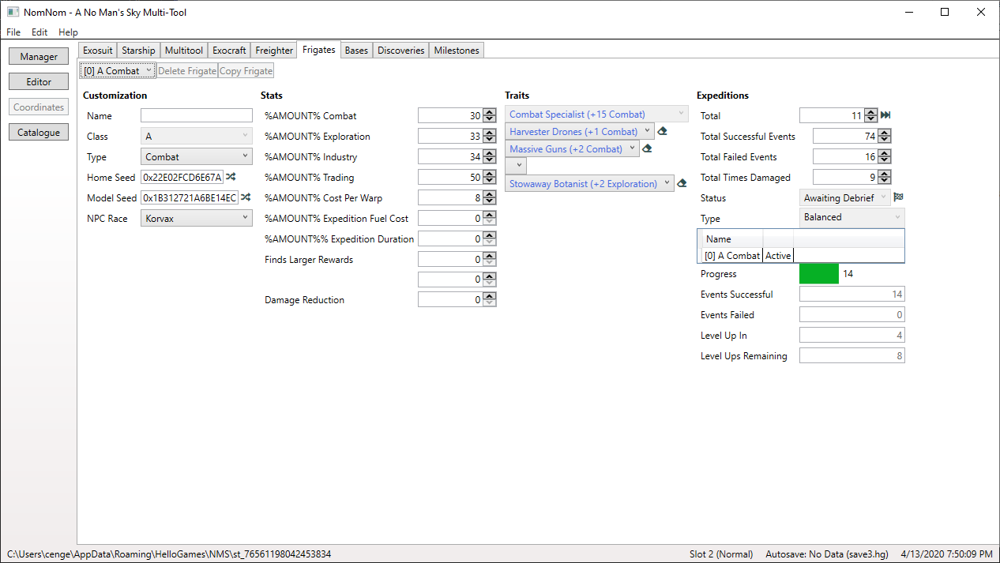

# NomNom

__Currently in early development.__ All features are
tested but mistakes can happen, so be aware of that and backup your saves! As
this README is designed for the final product, have a look at the
[FEATURES](FEATURES.md) file if you want to know what's already implemented.

UI is not final and will be cleaned up later. If
you encountered any bugs or when you think something doesn't work as expected
or could be improved (beside the UI and the things in the [ROADMAP](ROADMAP.md))
, let me know with as much information as possible.

Source code will be available with the first stable release.

## Introduction

NomNom is a savegame editor for [__No Man's Sky__](https://www.nomanssky.com/),
but also shows you a lot of additional information around the data you're about
to change. You can also easily look up each item individually to examine its
attributes, independently of a savegame, or get other useful information that
are not related to a specific savegame (but enhanced if one is loaded).

If you known the [NMSSE by goatfungus](https://github.com/goatfungus/NMSSaveEditor)
you will most certainly notice the similarity but his tool has things missing
that I'd like to have or just not implemented as I like to have it. I also
wanted to have a place where I can directly see how good my stats are, without
searching through an online wiki or such. Therefore I started my own project for
fun and here we are.

If you're interested in some technical insights in general, you can get some in
the [NMS Community Developers & Designers](https://nmscd.github.io/) DevTalks
that I join regularly.

There is a [Patreon page](https://www.patreon.com/cengelha) in case you want to
support me, but I will also use it as developer diary to keep you updated.

## Features

The features can divided into different main parts:
* __Manager__ Manage your saves!
  * Automatic backup and recovery (in case you screw something up).
  * Copy a save to another slot.
  * Save your save as human-readable JSON.
  * Delete your save.
* __Editor__ Edit your save for your needs!
  * Ability to manage fleets, change data values, and organize inventories.
  * Ability to fast travel to any system you like, trigger space battles, and
    clear portal interference.
  * Ability to customize appearances.
  * Ability to edit your knowledge and recorded experiences.
  * Ability to edit the raw JSON (for advanced users only).
* __Guide__ Useful tips!
  * What to expect in systems with specific races, wealth, etc.
* __Catalogue__ Explore all the items!
  * Just as in-game, look up items and get additional information about it.

A detailed list can be found [here](FEATURES.md) and a list of things to come
[here](ROADMAP.md).

 
 

The images are from version
[2.2.0.0-alpha.2](https://github.com/cengelha/NomNom/releases/tag/2.2.0.0-alpha.2).
More can be found [here](https://github.com/cengelha/NomNom/tree/master/images).

## Getting Started

### Requirements

* NomNom is compatible with the following platforms:
  Platform             | Compatible              | Note
  -------------------- | ----------------------- | ----
  PC - GOG             | <ul><li> [X] </li></ul> |
  PC - Microsoft Store | <ul><li> [ ] </li></ul> | investigating
  PC - Steam           | <ul><li> [X] </li></ul> |
  PlayStation          | <ul><li> [ ] </li></ul> |
  Xbox                 | <ul><li> [ ] </li></ul> |
* The latest version of NomNom is built for
  __No Man's Sky Exo Mech/Crossplay (2.4-2.5)__. If you use it with a game
  version branch below (e.g. __Beyond 2.0__) or above (e.g. __3.0__), things may
  not work correctly.
* You need .NET Framework 4.7.2.
  * It's included in the Windows 10 April 2018 Update and above.
  * Otherwise you can download it
    [here](http://go.microsoft.com/fwlink/?LinkId=863262).

### Instructions

1. As the tool includes an automatic backup functionality you don't need to do
   it manually but if you want to be absolutely save, do it.
1. You may want to create a shortcut to the executable for easier access.
1. At first start the tools tries to locate your savegames at the default
   location but if that fails, you have to select it manually.
1. Select a slot.
1. Start tinkering!

## Notes

* Restrictions that are enforced by the game, even if you changed it manually
  will not be possible to disable. If you can't do something, that's probably
  the reason why.

## Versioning

The versioning is oriented on the game version itself:

* _Major_ mirrors the games major version.
* _Minor_ represents big, named updates and mirrors their initial minor version
  (e.g. NEXT 1.5 or Synthesis 2.2).
* _Patch_ includes new features, bug fixes, updated game assets an such beside
  the named game updates.
* _Revision_ serves as public release counter.

## Changelog

The complete history can be found in the [CHANGELOG](CHANGELOG.md) file.

## Authors

* __Christian Engelhardt__ - [GitHub](https://github.com/cengelha) - [Nexus Mods](https://www.nexusmods.com/nomanssky/users/73645048) - [Patreon](https://www.patreon.com/cengelha) - [Reddit](https://www.reddit.com/user/zencq)

## License

This project is licensed under the GNU GPLv3 license - see the
[LICENSE](LICENSE) file for details.

## Credits

* [goatfungus](https://github.com/goatfungus/NMSSaveEditor) - [Kevin0M16](https://github.com/Kevin0M16/NMSCoordinates) - Inspiration and verifying my own implementation
* [hbouma](https://github.com/goatfungus/NMSSaveEditor/issues/158) - Explaining how clearing TerrainEdit works
* [jaszhix](https://github.com/jaszhix/NoMansConnect) - [rogerhnn](https://github.com/nmsportals/nmsportals.github.io) - Coordinate conversion
* [jeffswt](https://github.com/goatfungus/NMSSaveEditor/issues/200) - Algorithm for proper base computer moving
* [matthew-humphrey](https://github.com/matthew-humphrey/nmssavetool) - Decrypt and encrypt save files
* [monkeyman192](https://github.com/monkeyman192/MBINCompiler) - Extract data from the game files
* [u/_lmonk](https://www.reddit.com/r/NoMansSkyMods/comments/dkob5c/manual_ship_and_multitool_color_customization/) - Explaining how color customization for Starship and Multi-Tool works
