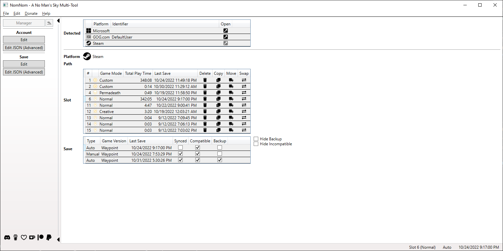
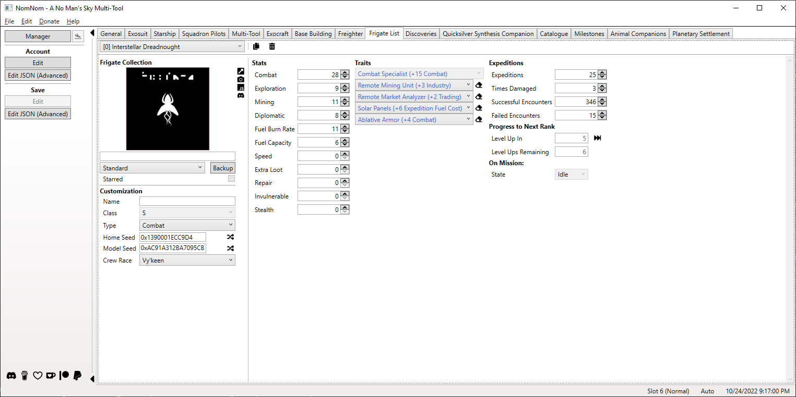
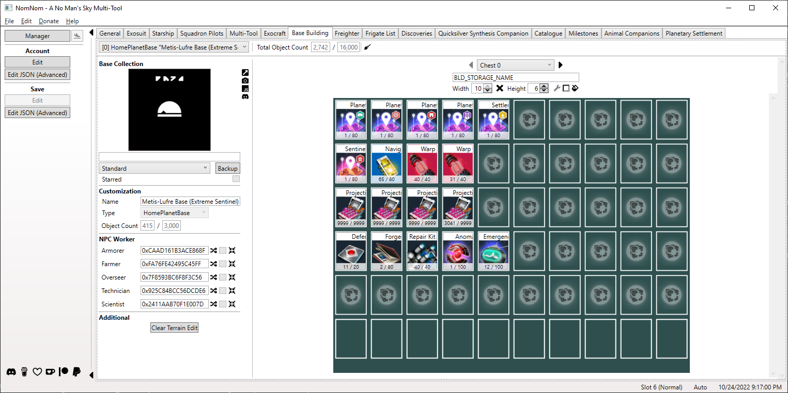

# NomNom

### Table of Contents

* [Introduction](#introduction)
* [Features](#features)
* [Getting Started](#getting-started)
  * [Compatibility](#compatibility)
  * [Requirements](#requirements)
  * [Download](#download)
  * [Instructions](#instructions)
* [Versioning](#versioning)
* [History](#history)
* [Contact \& Support](#contact--support)

## Introduction

NomNom is the most complete savegame editor for [**No Man's Sky**](https://www.nomanssky.com/),
and also shows contextual information around the data you are about to change. You
can also easily look up each item individually to examine its attributes, independently
of a save, or get other useful information that are not related to a specific save
(but enhanced if one is loaded).

## Features

The features of NomNom can be divided into the different main parts you will see
below. A detailed list can be found in the [FEATURES](FEATURES.md) file.
* __Manager__ Manage your saves!
    * Automatic backup and recovery (in case you screw something up).
    * Save your save as human-readable JSON.
    * Copy, move, and swap slots to another.
    * Transfer your save to another platform you own the game on.
    * Delete your save.
* __Editor__ Edit your save for your needs!
    * Ability to edit cross-save rewards from Expeditions, Twitch Drops, Titles
      and more.
    * Ability to manage fleets, change data values like currencies and stats,
      and organize inventories.
    * Ability to fast travel to any system you like and trigger space battles.
    * Ability to customize appearances.
    * Ability to edit your knowledge and recorded experiences.
    * Ability to edit the raw JSON (for advanced users).
<!-- * __Guide__ Useful tips!
    * What to expect in systems with specific races, wealth, etc.
* __Catalogue__ Explore all the items!
    * Just as in game, look up items and get additional information about it. -->

 
 

The images are from version
[4.00.0.31-beta.1](CHANGELOG.md#400031-beta1-2022-10-31).
More and maybe newer can be found [here](https://github.com/cengelha/NomNom/tree/master/.github/images).

## Getting Started

### Compatibility

Each version of NomNom is built with the latest game version (at that time) in mind
and the [version number](#versioning) is reflecting that. Each one is also backwards
compatible down to **Beyond 2.11** and even saves before that can still be edited
via the build-in JSON editor. If you use it with a newer game version branch than
the one it was build for (e.g. **5.00**), things should work as usual in most cases
but there can always be a breaking change.

Each game version is properly supported with its own set of available items and
features so you do not have to worry about adding unavailable items.

NomNom is compatible with every platform No Man's Sky is available on (some work
better than others though). You can select a specific account/folder with you saves
or, for platforms on PC, one level above if you have multiple accounts.

[A complete and always up-to-date overview with additional notes can be found here](https://github.com/zencq/libNOM.io?tab=readme-ov-file#getting-started).

### Requirements

You just need to install the **[.NET 6 Desktop Runtime](https://dotnet.microsoft.com/download/dotnet/6.0)**
and that is it.

### Download

* [GitHub](https://github.com/zencq/NomNom/releases)
* [Nexus Mods](https://www.nexusmods.com/nomanssky/mods/1566?tab=files)

### Instructions

1. After downloading and extracting the zip file you'll find a few files. All
   you need to care about is the executable (`NomNom.exe`) but new folders may
   be created at runtime (e.g. for backups) that will become relevant to you.
1. You may want to create a shortcut to the executable for easier access.
1. As the tool includes an automatic backup functionality you don't need to do
   it manually but if you want to be absolutely save, do it.
1. At first start the tools locates your saves at the default
   location of each platform but if that fails, you have to select it manually.
1. Select a slot.
1. Start tinkering!
1. Guide and Catalogue will work without loading a save.

## Versioning

The versioning is oriented on the game version itself:

* _Major_ mirrors the games major version.
* _Minor_ mirrors the games initial minor version of named updates
  (e.g. **Synthesis 2.20** or **Outlaws 3.85**).
* _Patch_ is for every release between two named updates, including new features,
  bug fixes, updated game assets, etc.
* _Revision_ serves as public release counter.

## History

The complete history can be found in the [CHANGELOG](CHANGELOG.md) file.

## Contact & Support

If you like NomNom and want to support me in its further development, you can do
so here on [__GitHub__](https://github.com/sponsors/cengelha), on [__Buy Me a Coffee__](https://www.buymeacoffee.com/cengelha), [__Ko-fi__](https://ko-fi.com/cengelha), or [__Patreon__](https://www.patreon.com/cengelha) or via [__PayPal__](https://www.paypal.me/cengelha).
I will appreciate it!

The official [__Discord__](https://discord.gg/nomnom-762409407488720918) server
is where you will find all information at one place, first hand. If you need (or
want to offer) help, found a bug, have a suggestion, or something else regarding
NomNom, you will find, or can post it there.

## License

This project is licensed under the GNU GPLv3 license - see the [LICENSE](LICENSE)
file for details.

## Authors

* **Christian Engelhardt** (zencq) - [GitHub](https://github.com/cengelha) - [Nexus Mods](https://www.nexusmods.com/nomanssky/users/73645048) - [Reddit](https://www.reddit.com/user/zencq)

## Credits

Thanks to the following people for their help in one way or another.

* [goatfungus](https://github.com/goatfungus/NMSSaveEditor) - Inspiration and verifying my own implementation
* [hbouma](https://github.com/goatfungus/NMSSaveEditor/issues/158) - Explaining how clearing TerrainEdit works
* [jeffswt](https://github.com/goatfungus/NMSSaveEditor/issues/200) - Algorithm to properly move base computer
* [jaszhix](https://github.com/jaszhix/NoMansConnect) - [rogerhnn](https://github.com/nmsportals/nmsportals.github.io) - Coordinate conversion
* [KhaozTopsy](https://api.nmsassistant.com) - Creating the Assistant for No Man's Sky API to get live data and make the transfer to the app possible
* Novoca1n3 - Providing a proof-of-concent for the JSON editor with tree view
* [zousug](https://discord.gg/nomnom-762409407488720918) - Helping to set up the Discord server

And not to forget those whose help contributed to parts of the outsourced libraries
[libNOM.collect](https://github.com/zencq/libNOM.collect#credits), [libNOM.io](https://github.com/zencq/libNOM.io#credits), and [libNOM.map](https://github.com/zencq/libNOM.map#credits).

## Dependencies

* [Humanizer.Core](https://www.nuget.org/packages/Humanizer.Core/) - manipulating and displaying strings, enums, and more
* [LazyCache](https://www.nuget.org/packages/LazyCache/) - in-memory caching
* [libNOM.collect](https://github.com/zencq/libNOM.collect) - backup and restore collections
* [libNOM.io](https://github.com/zencq/libNOM.io) - read and write save files as well as related actions
* [libNOM.map](https://github.com/zencq/libNOM.map) - obfuscate and deobfuscate save files
* [Newtonsoft.Json](https://www.nuget.org/packages/Newtonsoft.Json/) - high-performance JSON framework
* [Octokit](https://www.nuget.org/packages/Octokit/) - GitHub API
* [Pfim](https://www.nuget.org/packages/Pfim/) - image decoder for direct draw surface (.dds) images
* [RestSharp](https://www.nuget.org/packages/RestSharp/) - generic REST API
* [Unleash.Client](https://www.nuget.org/packages/Unleash.Client/) - feature toggles
