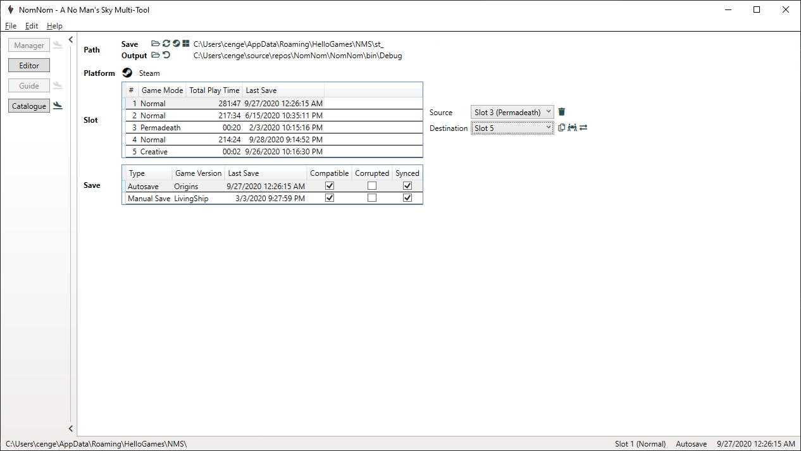
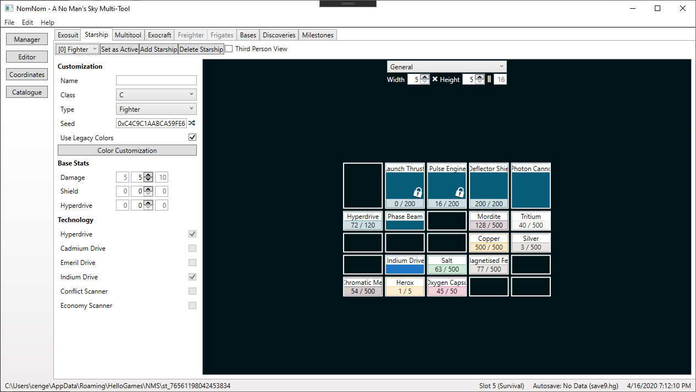
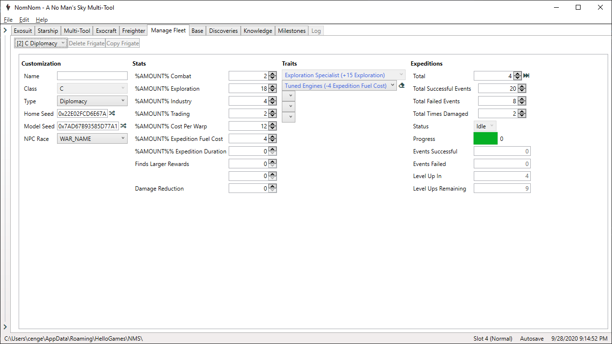
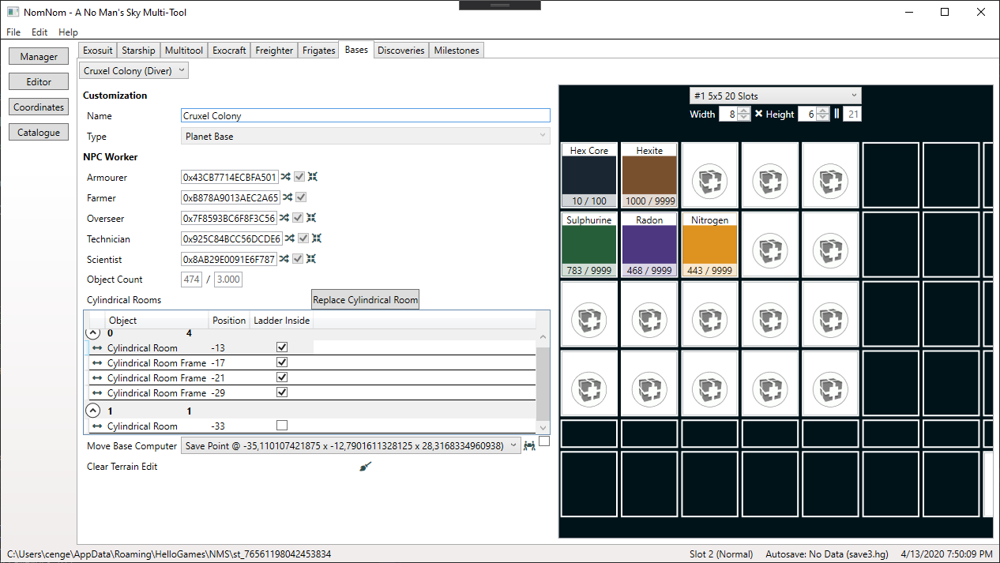

# NomNom

## Introduction

NomNom is a savegame editor for [__No Man's Sky__](https://www.nomanssky.com/),
but also shows you additional information around the data you're about to change.
You can also easily look up each item individually to examine its
attributes, independently of a savegame, or get other useful information that
are not related to a specific one (but enhanced if one is loaded).

You will most certainly notice a similarity to the editor by [goatfungus](https://github.com/goatfungus)
but when this project started it was the only one and the general layout works
well, so why reinventing the wheel? But there are features missing I'd like to
have and (in my eyes) bad usability in some areas. I also wanted to have a place
where I can directly see how good my stats are, without searching through an
online wiki or such. Therefore I started my own project for fun and here we are.

## State of Development

**The source code will be available at the earliest by moving to the beta state.**

**NomNom is currently in a alpha state.** This means
for you that things may be a little buggy and the UI is definitely not final. If you
encountered bugs or when you think something doesn't work as expected or could
be improved, [let me know](#contact--support)!

All available features are tested while implemented but
mistakes can happen, so be aware of that and backup your saves!

The current roadmap is a mix of feature polishing and some new features. The polishing
will be fixes where something is broken, extensions where possible or needed, and
of course the UI updated.

Parts of this README might be designed for the final product, so have a look at
the [FEATURES](FEATURES.md) file if you want to know exactly what's already implemented.

## Features

The features of NomNom can be divided into the different main parts you'll see
below. A detailed list can be found in the [FEATURES](FEATURES.md) file.
* __Manager__ Manage your saves!
    * Automatic backup and recovery (in case you screw something up).
    * Save your save as human-readable JSON.
    * Copy, move, and swap slots to another.
    * Transfer your save to another platform you own the game on.
    * Delete your save.
* __Editor__ Edit your save for your needs!
    * Ability to edit cross-save rewards from Expeditions, Twitch Drops, Titles
      and more.
    * Ability to manage fleets, change data values like currencies and stats,
      and organize inventories.
    * Ability to fast travel to any system you like and trigger space battles.
    * Ability to customize appearances.
    * Ability to edit your knowledge and recorded experiences.
    * Ability to edit the raw JSON (for advanced users).
* __Guide__ Useful tips!
    * What to expect in systems with specific races, wealth, etc.
* __Catalogue__ Explore all the items!
    * Just as in game, look up items and get additional information about it.

 
 

The images are from version
[3.0.0.8-alpha.8](CHANGELOG.md#3008-alpha8-2020-10-04).
More and maybe newer can be found [here](https://github.com/cengelha/NomNom/tree/master/images).

## Getting Started

### Requirements

* Each platform has anchor file patterns to check whether it's worth to look
  further into the default directory of a platform (or a selected one) or not.
  This must be in or one directory below the selected one.
* NomNom is compatible with almost every platform of the game:
    * [GOG.com](https://www.gog.com/game/no_mans_sky) (PC)
        * File Patterns: __save*.hg__
        * Notes: Same file format as Steam. Even though everything in NomNom is labeled with
          Steam, you can use it without restrictions.
    * [PlayStation 4](https://store.playstation.com/?resolve=EP2034-CUSA03952_00-NOMANSSKYHG00001)
        * File Patterns: __memory.dat__, __savedata*.hg__
        * Notes: The new save streaming system is only supported by [SaveWizard](https://www.savewizard.net)!
          If you still use an older version of the game, SaveWizard and [Save Mounter](https://github.com/ChendoChap/Playstation-4-Save-Mounter)
          are supported. Results of other tools may or may not work.
    * [PlayStation 5](https://store.playstation.com/?resolve=EP2034-CUSA03952_00-NOMANSSKYHG00001)
        * Notes: This version of the game is not supported due to restrictions on the console
          itself. By playing the PlayStation 4 version on it, you can still save edit
          with [a few additional steps](https://docs.google.com/document/d/1QoD2-PNlX-HeR5K1zuPGLMLBcX4_wknkhzc43-9bEq4/edit?usp=sharing).
    * [Steam](https://store.steampowered.com/app/275850/No_Mans_Sky/) (PC)
        * File Patterns: __save*.hg__
    * [Microsoft Store](https://www.microsoft.com/p/no-mans-sky/bqvqtl3pch05) (PC)
        * File Patterns: __containers.index__
        * Notes: Reloading of modified saves while the game is running does not work and you
          do not see an updated timestamp.
    * [Xbox One/Series X\|S](https://www.microsoft.com/p/no-mans-sky/bqvqtl3pch05)
        * Notes: Not directly supported but can easily achieved with cloud sync via the
          Microsoft Store. The synchronisation is triggered short after you close the game.
* The latest version of NomNom is built with **Outlaws (3.85)** in
  mind but is compatible with **Beyond (2.11)** and up. If you use it with a
  game version branch above (e.g. **4.0**), things should work as usual in most
  cases but there can always be a breaking change. Watch out for notices about
  new game updates.
* You need .NET Framework 4.8.
    * It is included in the Windows 10 May 2019 Update (1903) and above, otherwise you have to [download](https://dotnet.microsoft.com/download/dotnet-framework/net48) it.
    * There will be an upgrade to [.NET 6](https://dotnet.microsoft.com/download/dotnet/6.0)
      in the future but you can already download the required **.NET Desktop Runtime**.

### Download

* [GitHub](https://github.com/cengelha/NomNom/releases) (NomNom.zip)
* [Nexus Mods](https://www.nexusmods.com/nomanssky/mods/1566?tab=files)

### Instructions

1. After downloading and extracting the zip file you'll find a few files. All
   you need to care about is the executable (`NomNom.exe`) but new folders may
   be created at runtime (e.g. for backups) that will become relevant to you.
1. You may want to create a shortcut to the executable for easier access.
1. As the tool includes an automatic backup functionality you don't need to do
   it manually but if you want to be absolutely save, do it.
1. At first start the tools tries to locate your saves at the default
   location of each platform but if that fails, you have to select it manually.
1. Select a slot.
1. Start tinkering!
1. Guide and Catalogue will work without loading a save.

## Versioning

The versioning is oriented on the game version itself:

* _Major_ mirrors the games major version.
* _Minor_ mirrors the games initial minor version of named updates
  (e.g. Synthesis 2.2).
* _Patch_ includes new features, bug fixes, updated game assets, and such beside
  the named game updates.
* _Revision_ serves as public release counter.

## Changelog

The complete history can be found in the [CHANGELOG](CHANGELOG.md) file.

There is also a [ROADMAP](ROADMAP.md) file with things planned for the future. It's
not set in stone but you will get an idea what is coming next.

## License

This project is licensed under the GNU GPLv3 license - see the [LICENSE](LICENSE)
file for details.

## Contact & Support

If you like NomNom and want to support me in its further development, you can do
so here on [__GitHub__](https://github.com/sponsors/cengelha), on [__Buy Me a Coffee__](https://www.buymeacoffee.com/cengelha) or [__Patreon__](https://www.patreon.com/cengelha) or via [__PayPal__](https://www.paypal.me/cengelha).
I will appreciate it!

There won't be a paywall though. Buy Me a Coffee and Patreon will also be used to
keep you updated.

The official [__Discord__](https://discord.gg/3VrAhJVGn7) server will be the
place where you will find all information at one place, first hand. If you need
(or want to offer) help, found a bug, have a suggestion, or something else
regarding NomNom, you will find, or can post it there.

Issues created here on GitHub, at Nexus Mods, or send to me via another channel
will of course also be addressed.

## Authors

* **Christian Engelhardt** (zencq) - [GitHub](https://github.com/cengelha) - [Nexus Mods](https://www.nexusmods.com/nomanssky/users/73645048) - [Reddit](https://www.reddit.com/user/zencq)

## Credits

Thanks to the following people for their help in one way or another.

* [goatfungus](https://github.com/goatfungus/NMSSaveEditor) - [Kevin0M16](https://github.com/Kevin0M16) - Inspiration and verifying my own implementation
* [hbouma](https://github.com/goatfungus/NMSSaveEditor/issues/158) - Explaining how clearing TerrainEdit works
* [jeffswt](https://github.com/goatfungus/NMSSaveEditor/issues/200) - Algorithm to properly move base computer
* [jaszhix](https://github.com/jaszhix/NoMansConnect) - [rogerhnn](https://github.com/nmsportals/nmsportals.github.io) - Coordinate conversion
* [zousug#0826](https://discord.gg/3VrAhJVGn7) - Setting up the Discord server
* [Dr. Kaii](https://www.nexusmods.com/nomanssky/mods/1879) - Collaboration to create a common import/export format
* [u/Gumsk](https://www.reddit.com/r/NoMansSkyTheGame/comments/lk6yk6/how_to_move_a_gamepass_save_to_steam/) - Working out how to properly move a save from Windows Store to Steam
* [u/_lmonk](https://www.reddit.com/r/NoMansSkyMods/comments/dkob5c/manual_ship_and_multitool_color_customization/) - Explaining how color customization for Starships and Multi-Tools works
* [matthew-humphrey](https://github.com/matthew-humphrey/nmssavetool) - [MetaIdea](https://github.com/MetaIdea/nms-savetool) - Decrypt and encrypt Steam saves
* [u/MegaGold_Fighter](https://www.reddit.com/r/NoMansSkyMods/comments/hhe2he/ps4_nms_save_editing_general_guide/) - [Storm21](https://psxtools.de/index.php?user/38756-storm21/) - Providing valuable data to make PlayStation support possible
* [monkeyman192](https://github.com/monkeyman192/MBINCompiler) - MBINCompiler to extract data from the game files
* [Moo#6953](https://discord.gg/22ZAU9H) - Helping and verifying to make Windows Store support possible
