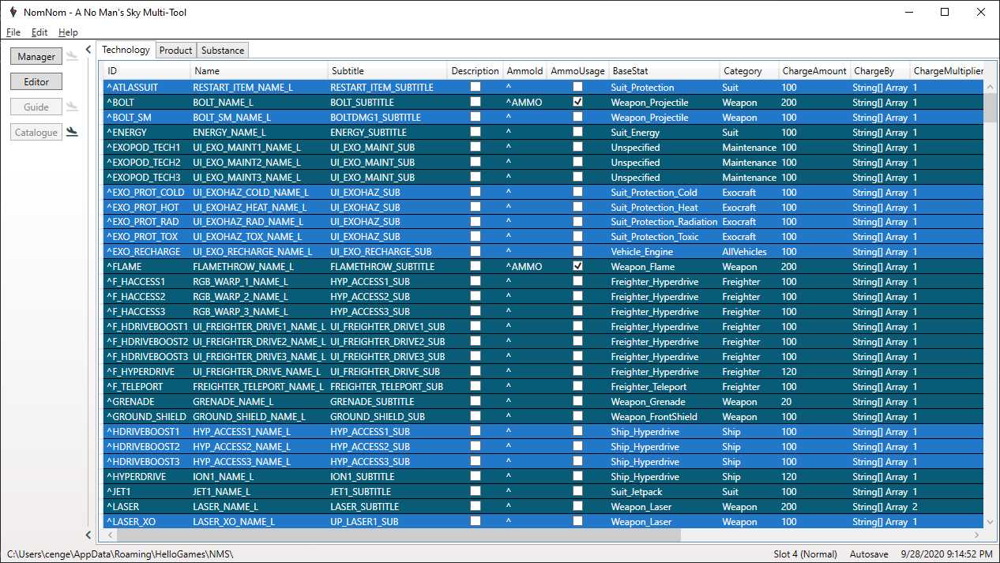

# NomNom

## Introduction

NomNom is savegame editor for __No Man's Sky__ but will also show you a lot a of additional
information around the raw data, which makes it a wiki to a certain degree.

If you known the [NMSSE by goatfungus](https://github.com/goatfungus/NMSSaveEditor)
you will most certainly notice the similarity but there are things missing that I'd like to have
or just not implemented as I like to have it. I also wanted to have a place where I can
directly see how good my stats are, without searching through a online wiki.
Therefore I started my own project for fun and here we are.

## Features

The features can be divided into 4 main parts:
* __Manager__ Manage your saves!
  * Automatic backup and recovery (in case you screw up something).
  * Copy a save to another slot.
  * Save your save as human readable JSON.
  * Delete your save.
* __Editor__ Edit your save for your needs!
  * Ability to change data values and organize inventories.
  * Ability to manage your fleet of frigates including expeditions.
  * Ability to customize appearances.
  * Ability to edit your knowledge and recorded experiences.
  * Ability to edit the raw JSON (for advanced users only).
* __Coordinates__ Travel around the galaxy!
  * Fast travel to any system you like.
  * Trigger space battles.
  * Clear portal interference.
* __Discovery__ Useful tips!
  * Plant grow time.
  * What to expect in system with specific races, wealth, etc.
* __Catalogue__ Explore all the items!
  * Just as in-game, look up items and get additional information about it.

A detailed list can be found [here](FEATURES.md) and a list of things to come [here](ROADMAP.md).

The images are from version [2.2.0.0](). More can be found [here](images).

## Getting Started

### Requirements

* The newest version of NomNom is built for __No Man's Sky Synthesis (2.2)__.
  If you use it with a game version branch below (e.g. __Beyond 2.0__)
  or above (e.g. __2.3__), things may not work correctly.
* You need .NET Framework 4.7.2.
  * It's included in the Windows 10 April 2018 Update and above.
  * Otherwise you can download it [here](http://go.microsoft.com/fwlink/?LinkId=863262).

### Instructions

1. As the tool includes an automatic backup functionality you don't need to do it manually
   but if you want to be absolutely save about it, do it.
1. At first start the tools tries to locate saves at the default locations but if that fails,
   you have to select it manually.
1. Select a slot.
1. Start tinkering!

## Notes

* Restrictions that are enforced by the game, even if you changed it before in the editor will not be possible to disable. So if you can't do something, that's probably the reason for it.
* Items _FOUNDATIONLEG_ and _FOUNDATION_LEG4_ are not listed as they cannot be used in-game even though they are unlockable in the Nexus.

## Versioning

The version is oriented loosely on the game version:

* _Major_ mirrors the games major version.
* _Minor_ represents big, named updates and mirrors their initial minor version
  (e.g. NEXT 1.5.0.0 or Synthesis 2.2.0.0).
* _Patch_ is actually for new features and such.
* _Revision_ includes bug fixes and minor changes like updated game assets.

## Changelog

The complete history can be found in the [CHANGELOG](CHANGELOG.md) file.

## Authors

* __Christian Engelhardt__ - [GitHub](https://github.com/cengelha) - [Reddit](https://www.reddit.com/user/zencq)

## License

This project is licensed under the GNU GPLv3 license - see the [LICENSE](/LICENSE) file for details.

## Credits

* [goatfungus](https://github.com/goatfungus/NMSSaveEditor)
* [hbouma](https://github.com/goatfungus/NMSSaveEditor/issues/158)
* [jeffswt](https://github.com/goatfungus/NMSSaveEditor/issues/200)
* [Kevin0M16](https://github.com/Kevin0M16/NMSCoordinates)
* [matthew-humphrey](https://github.com/matthew-humphrey/nmssavetool)
* [u/_lmonk](https://www.reddit.com/r/NoMansSkyMods/comments/dkob5c/manual_ship_and_multitool_color_customization/)
* [u/Artimec_w](https://www.reddit.com/r/NoMansSkyMods/comments/6fr5td/tutorial_convert_signal_booster_coordinates_to/)
